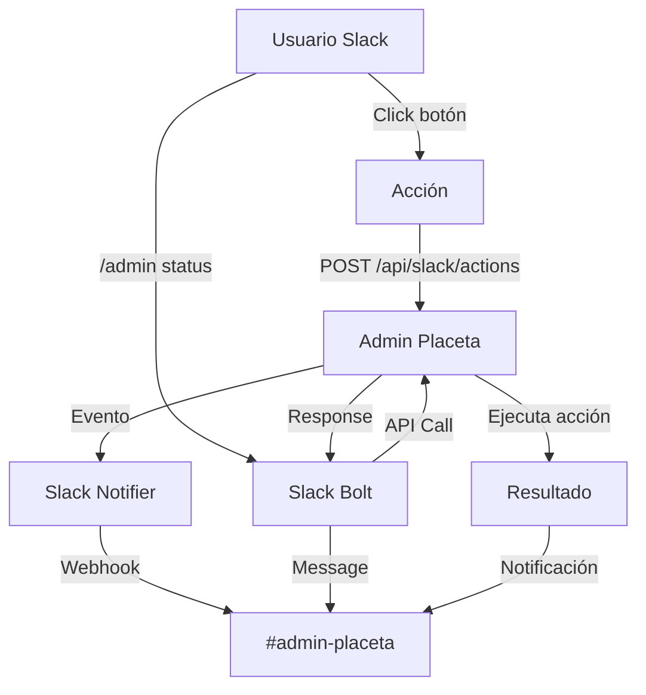

# Integración del Panel de Administración con Slack

## 📋 Resumen Ejecutivo

Propuesta de integración entre **Admin Placeta** y **Slack** para recibir notificaciones en tiempo real, aprobar acciones, monitorizar actividad, y gestionar el sistema directamente desde Slack.

---

## 🏗️ Arquitectura Propuesta

```
Admin Placeta ──→ Slack Webhook ──→ Canal #admin-placeta
       │                                       │
       │  Slack Bolt (JS) ◄────── Slash Commands / Modals
       │                                       │
       ▼                                       ▼
  Slack Notifier (service)            Interacciones bidireccionales
```

### Componentes:
1. **Slack Webhook (entrante)** — Notificaciones unidireccionales
2. **Slack Bolt App** — Comandos slash, modals, acciones interactivas
3. **Servicio `slackNotifier.js`** — Wrapper que unifica el envío

---

## 📦 Dependencias

```bash
npm install @slack/webhook @slack/bolt
```

---

## 🔌 Fase 1 — Notificaciones Unidireccionales (Webhook)

### 1.1 Servicio Slack Notifier

**Archivo:** `src/services/slackNotifier.js`

```javascript
import { IncomingWebhook } from '@slack/webhook';

const WEBHOOK_URL = process.env.SLACK_WEBHOOK_URL;
const webhook = new IncomingWebhook(WEBHOOK_URL);

const ENTITY_EMOJIS = {
  banco: ':bank:', tributos: ':chart_with_upwards_trend:',
  junta: ':scales:', administracion: ':gear:'
};

export async function notifySlack({ entidad, evento, titulo, descripcion, usuario, link }) {
  if (!WEBHOOK_URL) return;
  await webhook.send({
    blocks: [
      {
        type: 'header',
        text: { type: 'plain_text', text: `${ENTITY_EMOJIS[entidad] || ':memo:'} ${evento}` }
      },
      {
        type: 'section',
        fields: [
          { type: 'mrkdwn', text: `*📄 Título:*\n${titulo}` },
          { type: 'mrkdwn', text: `*🏛️ Entidad:*\n${entidad}` },
          { type: 'mrkdwn', text: `*👤 Usuario:*\n${usuario || 'Sistema'}` },
          { type: 'mrkdwn', text: `*🕐 Fecha:*\n${new Date().toLocaleString('es-ES')}` }
        ]
      },
      { type: 'section', text: { type: 'mrkdwn', text: descripcion } },
      ...(link ? [{ type: 'section', text: { type: 'mrkdwn', text: `<${link}|🔗 Abrir en Admin Placeta>` } }] : [])
    ]
  });
}
```

### 1.2 Eventos a notificar

| Evento | Disparador | Canal sugerido |
|---|---|---|
| Documento creado | `POST /api/:entidad/documentos` | `#admin-placeta-docs` |
| Documento firmado | `POST /api/:entidad/documentos/:id/firmar` | `#admin-placeta-docs` |
| Declaración creada/publicada | `PUT /tributos/api/declaraciones/:id/publish` | `#admin-placeta-tributos` |
| Declaración aprobada/emitida | `PUT /tributos/api/declaraciones/:id/approve` | `#admin-placeta-tributos` |
| Bloqueo/desbloqueo PlacetaID | `POST /api/placetaid/desbloquear/:dip` | `#admin-placeta-seguridad` |
| Exceso de capital detectado | `GET /banco/control-cumplimiento` | `#admin-placeta-alertas` |
| Nuevo usuario registrado | `POST /auth/register` | `#admin-placeta-general` |
| Error crítico del servidor | Global error handler | `#admin-placeta-errores` |

### 1.3 Integración en rutas existentes

Ejemplo en `src/routes/documentos.js`:

```javascript
import { notifySlack } from '../services/slackNotifier.js';

// Dentro del POST crear documento:
await notifySlack({
  entidad,
  evento: '📄 Documento Creado',
  titulo: doc.titulo,
  descripcion: `Se ha creado un nuevo documento tipo "${doc.tipo}"`,
  usuario: req.session.usuario?.nombre,
  link: `${BASE_URL}/${entidad}/documentos`
}).catch(() => {}); // No bloquear si Slack falla
```

---

## 🎮 Fase 2 — Comandos Interactivos (Slack Bolt)

### 2.1 Servidor Bolt

**Archivo:** `slack-bot.js` (independiente o embebido)

```javascript
import { App } from '@slack/bolt';

const app = new App({
  token: process.env.SLACK_BOT_TOKEN,
  signingSecret: process.env.SLACK_SIGNING_SECRET,
  socketMode: true,
  appToken: process.env.SLACK_APP_TOKEN
});
```

### 2.2 Comandos Slash propuestos

| Comando | Acción | Ejemplo |
|---|---|---|
| `/admin status` | Estado del sistema y KPIs | `📊 Usuarios: 1.234 · Docs: 567 · Alertas: 3` |
| `/admin buscar <q>` | Buscar documentos/usuarios | `/admin buscar DIP 20521220` |
| `/admin ultimos` | Últimas 5 actividades | Muestra últimas acciones en el panel |
| `/admin alertas` | Alertas activas (capital, incidencias) | Lista incidencias sin resolver |
| `/admin aprobar <id>` | Aprobar declaración desde Slack | `/admin aprobar DEC-ABC123` (con confirm) |
| `/admin firmar <docId>` | Firmar documento | `/admin firmar DOC-456` |
| `/admin help` | Lista de comandos disponibles | |

### 2.3 Ejemplo: comando `/admin status`

```javascript
app.command('/admin', async ({ command, ack, say }) => {
  await ack();
  const [subcmd, ...args] = command.text.split(' ');

  switch (subcmd) {
    case 'status': {
      const state = await apiBancoGetState();
      const docs = getDocumentosByEntidad('banco');
      await say({
        blocks: [
          { type: 'section', text: { type: 'mrkdwn', text: `*📊 Admin Placeta — Estado del Sistema*` } },
          { type: 'section', fields: [
            { type: 'mrkdwn', text: `*Cuentas:* ${state?.accounts?.length || 0}` },
            { type: 'mrkdwn', text: `*Documentos:* ${docs.length}` },
            { type: 'mrkdwn', text: `*Saldo total:* ${state?.accounts?.reduce((s,c) => s+(c.balancePz||0), 0).toLocaleString()} Pz` },
            { type: 'mrkdwn', text: `*Servidor:* ✅ OK` }
          ]}
        ]
      });
      break;
    }
    case 'help': {
      await say('*Comandos disponibles:*\n`/admin status` · `/admin buscar <q>` · `/admin ultimos` · `/admin alertas` · `/admin aprobar <id>` · `/admin firmar <docId>`');
      break;
    }
  }
});
```

### 2.4 Modals de confirmación

```javascript
app.command('/admin', async ({ command, ack, body, client }) => {
  await ack();
  if (command.text.startsWith('aprobar')) {
    await client.views.open({
      trigger_id: body.trigger_id,
      view: {
        type: 'modal',
        callback_id: 'aprobar_declaracion',
        title: { type: 'plain_text', text: 'Aprobar Declaración' },
        blocks: [
          { type: 'section', text: { type: 'mrkdwn', text: `¿Aprobar la declaración *${id}*?` } },
          { type: 'input', block_id: 'comentario',
            element: { type: 'plain_text_input', action_id: 'texto', multiline: true, placeholder: 'Comentario opcional' },
            label: { type: 'plain_text', text: 'Comentario' } }
        ],
        submit: { type: 'plain_text', text: '✅ Aprobar' }
      }
    });
  }
});
```

---

## 🧩 Fase 3 — Acciones desde Slack (Webhooks salientes)

### 3.1 Endpoint para recibir acciones

**Archivo:** `src/routes/slack.js`

```javascript
import { Router } from 'express';
import crypto from 'crypto';

const router = Router();

// Verificar firma de Slack
function verifySlack(req, res, next) {
  const signature = req.headers['x-slack-signature'];
  const timestamp = req.headers['x-slack-request-timestamp'];
  const sigBasestring = `v0:${timestamp}:${JSON.stringify(req.body)}`;
  const mySignature = 'v0=' + crypto.createHmac('sha256', process.env.SLACK_SIGNING_SECRET)
    .update(sigBasestring).digest('hex');
  if (crypto.timingSafeEqual(Buffer.from(signature), Buffer.from(mySignature))) return next();
  res.status(401).send('Invalid signature');
}

// Acciones de botón desde Slack
router.post('/slack/actions', verifySlack, async (req, res) => {
  const payload = JSON.parse(req.body.payload);
  // Procesar aprobaciones, firmas, etc.
  res.status(200).end();
});

export default router;
```

### 3.2 Acciones disponibles

| Botón | Acción | Endpoint llamado |
|---|---|---|
| ✅ Aprobar | Aprueba declaración | `PUT /tributos/api/declaraciones/:id/approve` |
| ✍️ Firmar | Firma documento | `POST /api/:entidad/documentos/:id/firmar` |
| 🔒 Bloquear | Bloquea PlacetaID | `POST /api/placetaid/desbloquear/:dip` |
| 👁️ Ver | Enlace directo al panel | Redirige a admin-placeta |

---

## ⚙️ Configuración

### Variables de entorno

```env
# Slack Webhook (notificaciones salientes)
SLACK_WEBHOOK_URL=https://hooks.slack.com/services/T00/B00/xxxxx

# Slack Bolt (interactivo)
SLACK_BOT_TOKEN=xoxb-xxxxx
SLACK_SIGNING_SECRET=xxxxx
SLACK_APP_TOKEN=xapp-xxxxx
SLACK_SLASH_TOKEN=xxxxx
```

### Canales de Slack sugeridos

| Canal | Propósito |
|---|---|
| `#admin-placeta-general` | Notificaciones generales |
| `#admin-placeta-docs` | Documentos creados/firmados |
| `#admin-placeta-tributos` | Declaraciones y alertas fiscales |
| `#admin-placeta-seguridad` | Intentos de acceso, bloqueos |
| `#admin-placeta-alertas` | Excesos de capital, incidencias |
| `#admin-placeta-errores` | Errores del servidor |

---

## 📈 Beneficios

- ✅ **Notificaciones en tiempo real** sin necesidad de abrir el panel
- ✅ **Aprobaciones rápidas** desde el móvil vía Slack (sin app nativa)
- ✅ **Monitorización** de alertas y excesos de capital
- ✅ **Auditoría**: todas las acciones quedan en Slack + en la BD
- ✅ **Multi-canal**: cada entidad puede tener su propio canal
- ✅ **Coste cero**: Slack Free Tier permite 10 acciones por minuto

---

## 🚧 Riesgos y consideraciones

| Riesgo | Mitigación |
|---|---|
| Slack rate limits (1 msg/seg) | Cola de mensajes con throttling |
| Token expuesto en entorno | Usar variables de entorno, no hardcodear |
| Falsificación de comandos | Verificar firma HMAC de Slack |
| Dependencia externa | Slack es opcional; el sistema funciona sin él |
| Seguridad en aprobaciones | Confirmación modal obligatoria en acciones críticas |

---

## 📐 Diagrama de flujo



---

## ✅ Próximos pasos

1. Configurar Slack App en [api.slack.com/apps](https://api.slack.com/apps)
2. Crear Webhook entrante para el canal deseado
3. Implementar `src/services/slackNotifier.js`
4. Añadir `notifySlack()` en puntos clave del sistema
5. Probar comandos slash en modo desarrollo (Socket Mode)
6. Desplegar Slack Bolt como servicio separado o embebido
